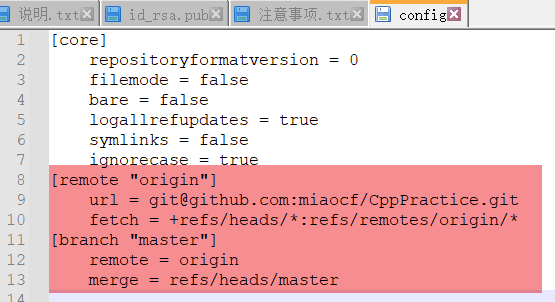

# README

## 简介

这是一个自己 `Cpp` 语言练习的仓库，同时也是自己学习用命令行操作 `git` 的学习过程。

主要分为了 `CppSingle` 和·`CppMulti` 两个目录，前者用于练习单文件的小程序，后者用于后续多文件的程序编写。

> 虽然暂时还没有启用。

## 1. CppSingle

* `Cvector.cpp`:  vector 容器的基本使用，包括多条件的排序。

## 2. CppMulti

:bulb:

## 3. 基础使用

| 命令                                   | 作用                           | 说明                                                         |
| -------------------------------------- | ------------------------------ | ------------------------------------------------------------ |
| git add .                              | 添加文件                       |                                                              |
| git commit                             | 提交                           | 会弹出一个VIM 的窗口，输入 `i` 进入编辑模式， 写完后输入 `:wq` 退出编辑模式 |
| git log                                | 查看提交内容                   |                                                              |
| git statue                             | 查看工作区状态                 |                                                              |
| git push -u origin branch_name         | 推送分支                       | 有一个 -u 参数，全称是 –set-upstream 即在远端如果没有则自动创建一个同名分支 |
| git –amend                             | 修改Commit message             |                                                              |
| git branch                             | 查看分支                       | -r 参数查看远端分支                                          |
| git branch –delete dev                 | 删除本地分支                   |                                                              |
| git push origin –delete branch         | 删除远端分支                   |                                                              |
| git checkout –track origin/branch_name | 本地创建一个远端同名分支并绑定 | git checkout -b new_branch_name branch_name 本地分支名和远端分支名不一样的时候 |

> 早日脱离小乌龟 Tortoise.

## 4. 问题记录

### 1. fatal: 'origin' does not appear to be a git repository

描述： 用`init` 命令初次初始化仓库后， 执行 `$ git push -u origin master` 推送远端仓库，则报了以上错误

解决办法：

* 关联远端仓库为 `origin`: `git remote add origin git@github:bx_reader/bx-reader-api.git`

* 本地文件夹`.git/config` 下手动关联 `remote` 选项卡下的 `url`

  
